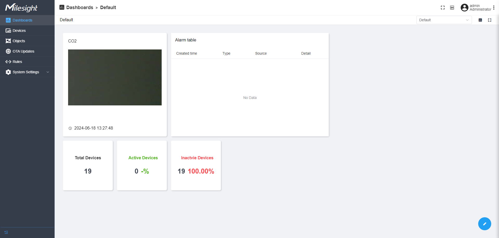
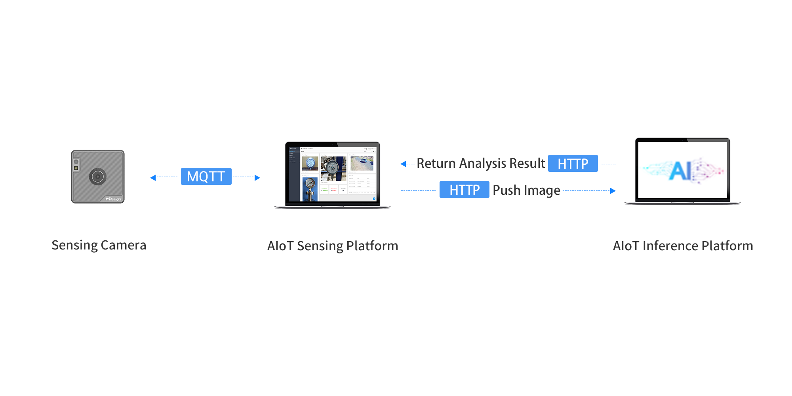

# AIoT Sensing Platform

 

AIoT Sensing Platform, based on the open-source Thingsboard (v3.5), provide an efficient solution to collect and store data from sensing cameras via MQTT protocol. Besides, the Milesight AIoT Sensing Platform is able to manage and maintain the remote sensing cameras.

Moreover, AIoT Sensing Platform can integrate with AIoT Inference Platform to recognize the picture data with equipped AI models and push the results to other platforms via MQTT or HTTP protocol. AIoT Inference Platform supports the extension of onnx model. For more information please refer to [AIoT Inference Platform User Guide](https://resource.milesight.com/milesight/iot/document/aiot-inference-platform-user-guide-en.pdf).



<br/>

## Key Features

- Manage bulks of devices and display the latest telemetry data
- Support to display as dashboard and provides 3 kinds of widgets to monitor device status, picture changes and device alarms
- Provides several types of trigger rules (Once data received、Low battery、Devices become inactive, etc.) and forward picture information to MQTT/HTTP recipients
- Support to draw the ROI area and define the objects for recognition of data
- Support to upgrade or deploy the configurations to devices over the air
- Provide the solution to achieve the picture recognition combing with AIoT Inference Platform


## Quick Start

### Install AIoT Sensing Platform

> This quick start guide introduces the steps to install AIoT Sensing Platform to a Ubuntu server. Before starting please ensure the [docker](https://docs.docker.com/engine/install/ubuntu/) is installed in your server.
>

#### Prerequisites

##### **Hardware**

- RAM: 4-8 GB

##### **Operating System**

- Ubuntu Kinetic 22.10
- Ubuntu Jammy 22.04 (LTS)
- Ubuntu Focal 20.04 (LTS)
- Ubuntu Bionic 18.04 (LTS)

#### Install Steps

##### 1. Download and Push Image

```
# Download image
wget https://github.com/Milesight-IoT/aiot-sensing-platform/1.0.1.1-r4/msaiotsensingplatform.tar
# Load docker image
docker load -i msaiotsensingplatform.tar
```

##### 2. Create Docker Compose File

```
#Create docker compose file
nano docker-compose.yml
```

Add below contents to docker-compose.yml file：

```
version: '3.0'
services:
  mysp:
    restart: always
    image: "msaiotsensingplatform:demo"
    ports:
      - "5220:9090"
      - "1883:1883"
      - "7070:7070"
      - "5683-5688:5683-5688/udp"
    environment:
      TB_QUEUE_TYPE: in-memory 
    volumes:
      - /var/mysp-data:/data
      - /var/mysp-logs:/var/log/msaiotsensingplatform
```

##### 3. Create User Permissions for New Folders

```
sudo useradd -m msaiotsensingplatform
sudo groupadd msaiotsensingplatform  //ignore the exist error
sudo usermod -aG msaiotsensingplatform msaiotsensingplatform
mkdir -p /var/mysp-data && sudo chown -R msaiotsensingplatform:msaiotsensingplatform /var/mysp-data
chmod -R 777 /var/mysp-data
mkdir -p /var/mysp-logs && sudo chown -R msaiotsensingplatform:msaiotsensingplatform /var/mysp-logs
chmod -R 777 /var/mysp-logs
```

##### 4. Run the Image

Start the image:

```
docker compose up -d
```

Open the Web GUI of AIoT Sensing platform:

```
# Default web GUI address
http://localhost:5220/
```
Log in the web GUI via default administrator account:
```
admin/password
```

<br/>

## More Use

### Reference

If you require the secondary development of AIoT Sensing Platform or work it with AIoT Inference Platform,  refer to [AIoT Sensing Platform Build Guide](doc/README_BUILD_EN.md).

<br/>

## Contributing

Welcome to contribute to this project following below steps:

1. Fork this repository
2. Create a branch to work on (git checkout -b feature/AmazingFeature)
3. Make and commit your changes (git commit -m 'Add some AmazingFeature')
4. Push your changes to branch (git push origin feature/AmazingFeature)
5. Make a pull request


## Community

Welcome to join the community to get involved in this project to report bugs, share the experiences, make discussions:

- [Discord](https://discord.gg/vNFxbwfErm "Discord")
- [Github](https://github.com/Milesight-IoT "GitHub")

## About Milesight

- [Linkedin](https://www.linkedin.com/company/milesightiot "Linkedin")
- [Youtube](https://www.youtube.com/c/MilesightIoT "Youtube")
- [Facebook](https://www.facebook.com/MilesightIoT "Facebook")
- [Instagram](https://www.instagram.com/milesightiot/ "Instagram")
- [Twitter](https://twitter.com/MilesightIoT "Twitter")
- [Milesight-Evie](https://www.linkedin.com/in/milesight-evie/ "Milesight-Evie")

## License

This project is released under the MIT license. See also [LICENSE](LICENSE).
