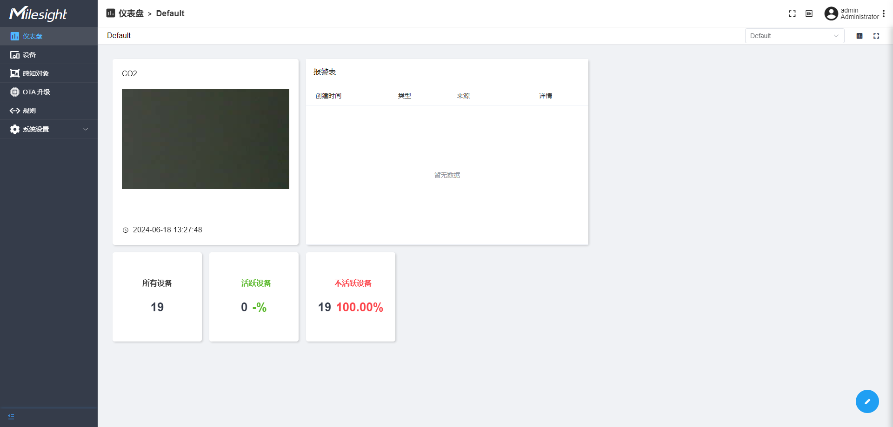
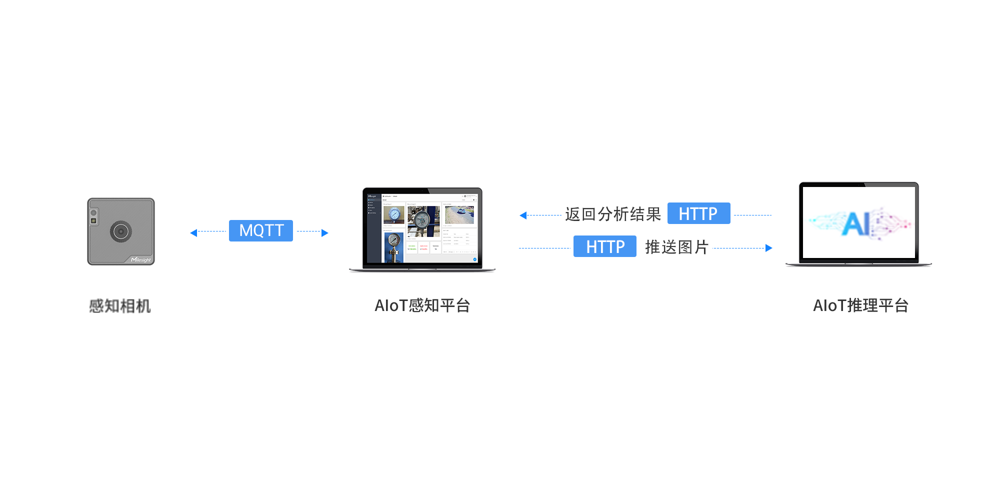

# 感知平台



感知平台是基于Thingsboard（v3.5）开源项目二次开发的一个产品，支持通过MQTT 协议搜集和存储来自感知相机的图片数据，以及实现批量远程管理和维护感知相机的功能。

此外，感知平台支持结合AI推理平台（内置表计识别等模型）识别图片上的数据并将识别结果推送通过MQTT或HTTP协议推送到第三方平台。其中推理平台支持onnx模型的拓展，如需结合AI推理平台使用请查看[推理平台用户手册](https://resource.milesight.com/milesight/iot/document/aiot-inference-platform-user-guide-en.pdf)。



<br/>

## 功能特性

**图片采集和设备管理**：设备管理列表，可以查看设备信息，活跃状态和最新遥测数据，图片数据可以绘制ROI识别，OTA升级固件选择等

**可视化仪表盘**：可视化组件操作面板，提供3种仪表板，可以监控设备全局状态、图片动态变化和设备告警信息

**规则引擎和接收方**：提供多种类型规则链（一旦收到数据、低电量、设备不活跃等)，支持通过MQTT/HTTP转发图片数据到第三方平台

**感知对象定义**：支持定义图片ROI区域用于识别

**设备配置和升级**：支持对设备进行远程OTA配置或升级

**结合推理平台**：结合AI推理平台可实现图片ROI识别，识别后回推结果到感知平台


## 快速开始

### 安装感知平台

本指南介绍了如何在Ubuntu服务器上安装感知平台。安装前请确保您的服务器已经安装了[docker](https://docs.docker.com/engine/install/ubuntu/)。

#### 先决条件

##### 硬件要求

- RAM: 4-8 GB

##### 操作系统要求

- Ubuntu Kinetic 22.10
- Ubuntu Jammy 22.04 (LTS)
- Ubuntu Focal 20.04 (LTS)
- Ubuntu Bionic 18.04 (LTS)

#### 安装步骤

##### 1. 下载和读取镜像

```
# 下载镜像
wget https://github.com/Milesight-IoT/aiot-sensing-platform/releases/download/1.0.1.1-r4/msaiotsensingplatform.tar
# 加载docker镜像
docker load -i msaiotsensingplatform.tar
```

##### 2. 创建Docker Compose文件

```
#创建docker执行文件
nano docker-compose.yml
```

将下列文本内容加入到docker-compose.yml文件中：

```
version: '3.0'
services:
  mysp:
    restart: always
    image: "msaiotsensingplatform:1.0.1.1-r4"
    ports:
      - "5220:9090"
      - "1883:1883"
      - "7070:7070"
      - "5683-5688:5683-5688/udp"
    environment:
      TB_QUEUE_TYPE: in-memory 
    volumes:
      - /var/mysp-data:/data
      - /var/mysp-logs:/var/log/msaiotsensingplatform
```

##### 3. 为新建的文件夹创建用户权限

```
sudo useradd -m msaiotsensingplatform
# 提示已存在忽略
sudo groupadd msaiotsensingplatform
sudo usermod -aG msaiotsensingplatform msaiotsensingplatform
mkdir -p /var/mysp-data && sudo chown -R msaiotsensingplatform:msaiotsensingplatform /var/mysp-data
chmod -R 777 /var/mysp-data
mkdir -p /var/mysp-logs && sudo chown -R msaiotsensingplatform:msaiotsensingplatform /var/mysp-logs
chmod -R 777 /var/mysp-logs
```

##### 4. 在docker配置文件对应目录下运行镜像

启动镜像：

```
docker compose up -d
```

启动后使用以下链接打开平台网页：

```
# 默认网址 
http://localhost:5220/
```
默认账号（用户名、密码）：
```
admin/password
```

<br/>

## 进一步使用

### 参考文档

如果你需要对感知平台进行二次开发或者需要结合AIoT推理平台使用，请查看完整文档：[感知平台使用文档](doc/README_BUILD_CN.md)

<br/>

## 贡献指南

欢迎任何形式的贡献！请遵循以下步骤提交您的贡献：

1. Fork 本仓库
2. 创建您的特性分支 (git checkout -b feature/AmazingFeature)
3. 提交您的更改 (git commit -m 'Add some AmazingFeature')
4. 推送到分支 (git push origin feature/AmazingFeature)
5. 打开一个 Pull Request


## 社区

加入我们的社区，获取帮助、分享经验、讨论项目相关内容：

- [Discord](https://discord.gg/vNFxbwfErm "Discord")
- [Github](https://github.com/Milesight-IoT "GitHub")

## 关注Milesight

- [Linkedin](https://www.linkedin.com/company/milesightiot "Linkedin")
- [Youtube](https://www.youtube.com/c/MilesightIoT "Youtube")
- [Facebook](https://www.facebook.com/MilesightIoT "Facebook")
- [Instagram](https://www.instagram.com/milesightiot/ "Instagram")
- [Twitter](https://twitter.com/MilesightIoT "Twitter")
- [Milesight-Evie](https://www.linkedin.com/in/milesight-evie/ "Milesight-Evie")

## 许可证

此存储库在 [MIT](LICENSE)下可用。
